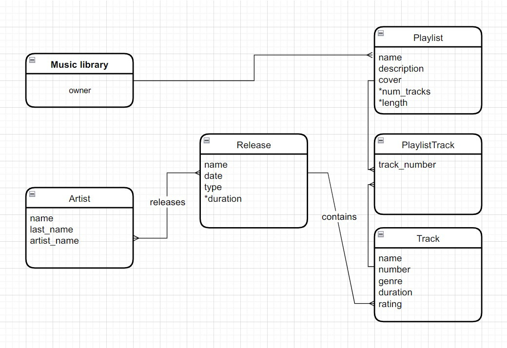
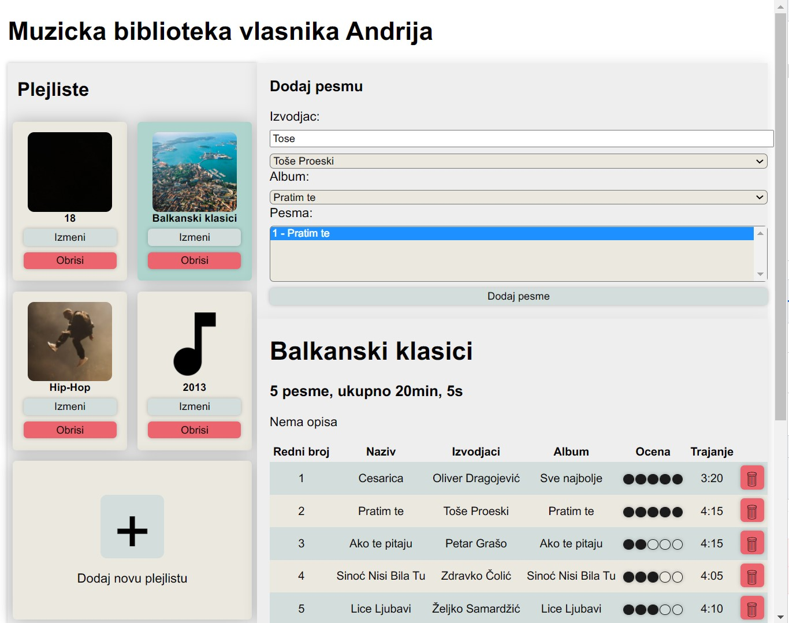

# Muzička biblioteka

## Relacioni dijagram

Horizontalni prikaz             |  Vertikalni prikaz
:-------------------------:|:-------------------------:
  |  

## Aplikacija
* Vlasnik muzičke biblioteke dobija grafički prikaz plejlisti koje trenutno ima u biblioteci.
* Ima mogućnost da pravi nove plejliste, da im menja naziv i da ih briše iz biblioteke.
* Klikom na plejlistu otvara se interfejs na kome može da dodaje i briše pesme iz plejliste.
* U tom delu interfejsa, na formi bira izvođača, jedno njegovo izdanje i proizvoljan broj pesama iz izabranog izdanja koje može da doda u plejlistu.
* Pesme koje pripadaju plejlisti su tabelarno prikazane.
* U tabelarnom prikazu korisnik može interaktivno da menja ocenu pesme od 1 do 5 klikom na kružić
* Klikom na dugme sa kanticom se briše pesma iz plejliste

## Implementacija
### Klijentski deo
* Klijentski deo je podeljen na [`Views`](./Client/Views) i [`Models`](./Client/Models)
#### Views
Aplikacija je podeljena u 2 View-a: `MusicLibraryView` i `PlaylistView`
* `MusicLibraryView` je zadužen za grafički prikaz plejlisti i za prikaz dugmića za sve operacije nad plejlistama
* `PlaylistView` je zadužen za prikaz forme, dugmeta za dodavanje pesme, plejliste, tabele i svih ostalih elemenata

#### Modeli
* `MusicLibrary`, `Artist`, `Release`, `Playlist`,  `Track`
* Postoji paralela između svih modela osim `PlaylistTrack` na klijentskoj i serverskoj strani, sa sitnim izmenama (samo neophondi atributi prilagođeni prikazu)

#### Rad sa podacima
* Za sve funkcije na serverskoj strani postoji paralelna funkcija na klijentskoj strani
* Validira se unos za naziv plejliste i na klijentskoj i na serverskoj strani, dodavanje duplikata u plejlistu i brisanje plejliste
* Izbegavao sam, gde mogu, korišćenje querySelector-a, i trudio se da reference na HTML elemente prenosim preko parametara funkcije.
* Svi podaci koji su prethodno pribavljeni iz baze se čuvaju u memoriji i koriste ponovo iz memorije (prvo se proverava da li ih ima), tako se baza ne preopterećuje i ne šalju nepotrebni novi zahtevi ka njoj.
* Umesto iscrtavanja celog izgleda ispočetka, na referencu HTML elementa se novi elementi `append`-uju, a postojeci se brišu preko `.remove()`

### Serverski deo
#### [Modeli](./Server/Models)
* `MusicLibrary`, `Artist`, `Release`, `Playlist`,  `Track`, `PlaylistTrack`
#### [Kontroleri](./Server/Controllers)
* Dodavanje i brisanje pesama iz plejliste podrazumeva izračunavanje i ažuriranje atributa (dužinu i broj pesama), kao i ažuriranje rednog broja pesama u plejlisti.
* Server vraća odgovarajuće kodove (`400`, `404`, `415`, `500`) ako nema traženih podataka u bazi ili dođe do neke greške.
* Izvođači, izdanja i pesme se vraćaju sa servera u uređenom redosledu